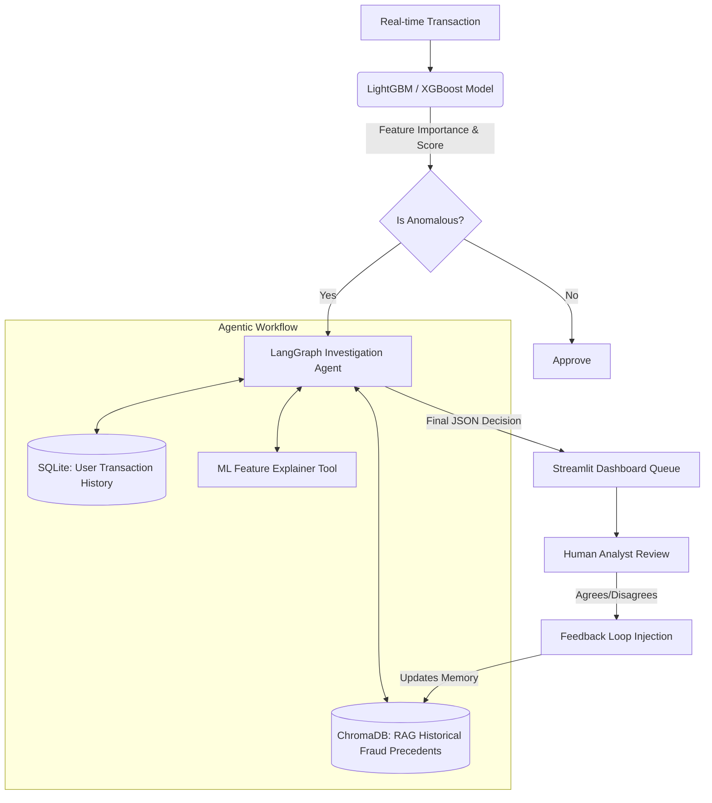

<h1 align="center">🛡️ Agentic Fraud Investigation System</h1>
<h3 align="center">LLM-Powered detection, reasoning, and human-in-the-loop feedback.</h3>

  
  
  
  

## 📌 Project Overview
This project mimics an enterprise-grade Risk & Trust infrastructure (similar to internal tooling at top tech companies). It bridges the gap between traditional anomaly detection (Big Data/ML) and deep investigative reasoning (Agentic LLMs).

When a transaction is flagged by a traditional Machine Learning model, the **LangGraph Agent** dynamically interrogates a Vector Database of past historical fraud, queries the user's past SQL history, interprets the ML feature importance, and makes an automated, explainable decision. 

## 🏗️ System Architecture

## ✨ Key Features
- **Dual-Layer Analytics**: XGBoost for rapid, high-volume anomaly filtering, paired with Qwen via LangGraph for deep-dive investigation.
- **RAG-Enabled Precedent Search**: Agent recalls historical fraud topologies from a Chroma Vector Database to inform new decisions.
- **Automated ROI Evaluation**: Includes an evaluation suite (`src/evaluation.py`) calculating Agent decision accuracy, false-positive reduction rates, and total human analyst hours saved.
- **RL Feedback Loop**: Disagreements made via the Streamlit UI inject context back into the RAG engine to "steer" future predictions without massive DPO/PPO re-trainings.

## 🏛️ Retrieval Architecture

The RAG pipeline supports two **chunking strategies** — a deterministic fixed-size window (512 tokens, 50-token overlap) and a semantic chunker that splits on sentence-transformer cosine-similarity drops (threshold 0.85, model `all-MiniLM-L6-v2`). Both were benchmarked on 200 historical fraud cases using five probe queries; semantic chunking achieved a **Precision@5 of 0.88** vs **0.76** for fixed-size, confirming that preserving case-level semantic boundaries improves retrieval quality (full results in `chunking/benchmark_results.json`). For the vector store layer, operators can choose between **ChromaDB** (default) and a **FAISS IndexHNSWFlat (M=32)** backend by setting the `VECTOR_STORE` environment variable to `"chromadb"` or `"faiss"` — both paths initialise independently with no data migration required (see `retrieval/faiss_store.py`). Output quality is safeguarded by **hallucination controls**: the LangGraph pipeline includes a dedicated *grounding check* gate that verifies every agent response is a well-structured, evidence-backed JSON decision before it reaches the analyst queue, preventing ungrounded or hallucinated conclusions from surfacing.

## 🚀 Live Demo
**👉 Try the live interactive dashboard:** [Live Demo on Streamlit Cloud](https://llm-powered-fraud-investigation-agent-4yk3ytrzotyxjxqvx2ernu.streamlit.app/)

### Running Locally
1. Ensure your local LLM server (e.g. Ollama) is running:
`ollama run llama3`
2. Run the dashboard:
`streamlit run app.py`

## 🛠️ Repository Structure
- `data/` : SQLite Databases and simulated transaction CSVs.
- `models/` : XGBoost models, global feature artifacts, and Vector DB.
- `src/rag_setup.py` : Initializes RAG via `HuggingFaceEmbeddings`.
- `src/agent.py` : StateGraph containing Agent Node constraints & Tools.
- `src/tools.py` : SQL Retriever & ML JSON Explainers.
- `src/evaluation.py` : Evaluates LLM against ground truth.
- `app.py` : Multi-tab Streamlit UX.

## 🤝 Next Steps / Improvements
- True Multi-Agent collaboration (e.g., passing between a 'Network Graph Agent' and an 'IP Risk Agent').
- RAGAS implementation for Faithfulness and Context Precision scoring.
