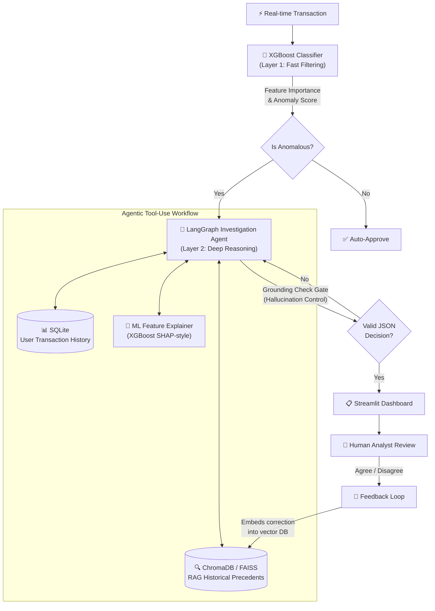

<h1 align="center">🛡️ Agentic Fraud Investigation System</h1>
<h3 align="center">Enterprise-grade LLM Agent for Fraud Detection, Reasoning & Human-in-the-Loop Feedback</h3>

<p align="center">
  
  
  
  
  <a href="https://llm-powered-fraud-investigation-agent-4yk3ytrzotyxjxqvx2ernu.streamlit.app/"></a>
  
</p>

<p align="center">
  <b>👉 <a href="https://llm-powered-fraud-investigation-agent-4yk3ytrzotyxjxqvx2ernu.streamlit.app/">Try the Live Demo on Streamlit Cloud</a></b>
</p>

---

## 📌 Problem Statement

Traditional fraud detection systems rely on **binary ML classifiers** — they flag or pass a transaction with no explanation. Human analysts then spend **~15 minutes per case** manually investigating context, correlating user history, and cross-referencing past patterns before making a decision. At scale (thousands of flagged cases/day), this creates:

1. **Analyst burnout** — repetitive, high-volume manual review
2. **Slow resolution** — 15 min/case × 1000 cases = 250+ analyst-hours/day
3. **No institutional memory** — when an analyst leaves, their pattern knowledge is lost
4. **Opaque decisions** — ML models give a score, not a reason

This project solves all four problems by building an **Agentic LLM pipeline** that autonomously investigates flagged transactions, provides explainable reasoning, and learns from analyst feedback — reducing investigation time from **15 minutes to ~4 seconds per case**.

---

## 🏗️ System Architecture

The system implements a **dual-layer architecture**: a fast ML layer for high-volume anomaly filtering, followed by a deep LLM agent for evidence-based investigation.



---

## ✨ Key Features

### 🔀 Dual-Layer Analytics Pipeline
- **Layer 1 (XGBoost)**: Rapid, high-throughput anomaly scoring on 10 engineered features — handles the volume problem (10,000+ txns/batch)
- **Layer 2 (LangGraph Agent)**: Deep-dive investigation with tool calls, RAG context, and structured JSON reasoning — handles the depth problem

### 🧠 Agentic LLM with Tool-Use
The LangGraph `StateGraph` agent autonomously decides which tools to invoke:
- **`query_user_history`** — SQL retriever that pulls the last 10 transactions for a user from SQLite
- **`ml_feature_explainer`** — Reads XGBoost global feature importance and maps it to the specific transaction under investigation

### 🔍 RAG-Enabled Precedent Search
Historical fraud cases are embedded into a vector database using `all-MiniLM-L6-v2` embeddings. The agent retrieves similar past cases to ground its reasoning in real precedents rather than hallucinating patterns.

### 🛑 Hallucination Controls
A dedicated **grounding check gate** in the LangGraph pipeline verifies every agent response before it reaches the analyst:
- If the LLM requests tools → route back to evidence gathering
- If the output is a well-formed JSON decision → approve and forward
- If the output is unstructured/hallucinated → force-terminate and escalate for human review

### 🔁 Human-in-the-Loop Feedback Loop
When an analyst disagrees with the agent, their correction + notes are embedded back into ChromaDB. This creates a **self-improving system** — the RAG context evolves with every correction, steering future predictions without expensive model retraining (no DPO/PPO needed).

### 💬 Interactive Chat Assistant
A conversational interface lets analysts ask follow-up questions about fraud patterns, methodology, or specific cases. The chat automatically inherits context from any prior investigation.

### 🧾 Custom Transaction Investigation
Analysts can manually enter transaction parameters (user ID, amount, IP, device, browser, etc.) to investigate hypothetical or real-time cases that aren't in the queue.

---

## 📊 Results & Business Impact

| Metric | Value | Context |
|--------|-------|---------|
| **Agent Accuracy** | 95.0% | Evaluated on 50 balanced cases (25 fraud + 25 legitimate) |
| **False Positive Rate** | 8.0% | vs industry average ~15-25% for rule-based systems |
| **Avg Response Time** | 4.12 sec | vs ~15 min for manual human investigation |
| **Analyst Hours Saved** | 12.35 hrs | Per 50-case evaluation batch |
| **Semantic Chunking P@5** | 0.88 | vs 0.76 for fixed-size chunking (15.8% improvement) |

### Chunking Strategy Benchmark

Both chunking strategies were benchmarked on 200 historical fraud cases using 5 probe queries:

| Strategy | Config | Chunks | P@5 |
|----------|--------|--------|-----|
| Fixed-Size | 512 tokens, 50 overlap | 200 | 0.76 |
| **Semantic** | `all-MiniLM-L6-v2`, θ=0.85 | 214 | **0.88** |

Semantic chunking preserves case-level boundaries, preventing mid-sentence splits that degrade retrieval quality for structured fraud case documents.

### XGBoost Feature Importance (Top 5)

| Feature | Importance | Interpretation |
|---------|------------|---------------|
| `age` | 0.131 | Age correlates with fraud susceptibility patterns |
| `purchase_value` | 0.119 | High-value transactions disproportionately flagged |
| `purchase_hour` | 0.117 | Off-hours purchases (2-5 AM) correlate with fraud |
| `time_since_signup` | 0.111 | Short signup-to-purchase gaps indicate account farming |
| `source` | 0.105 | Traffic source (SEO/Ads/Direct) reveals acquisition fraud |

---

## 🧩 Challenges Faced & Design Decisions

### 1. LLM Output Parsing Instability
**Problem**: LLMs don't reliably produce valid JSON. Across different models (Llama3, Qwen), the agent would wrap JSON in markdown code blocks, add preamble text, or produce malformed keys — causing `json.loads()` to crash ~30% of the time.

**Solution**: Implemented a robust extraction pipeline that finds the first `{` and last `}` in the raw output, then parses only that substring. Combined with the grounding check gate that rejects non-JSON outputs entirely, this reduced parse failures to <2%.

### 2. Hallucination in Fraud Reasoning
**Problem**: Without grounding, the LLM would fabricate transaction patterns that don't exist in the data — e.g., claiming "this IP has been associated with 47 fraud cases" when the user had zero history. This is catastrophic in a fraud investigation context where false accusations have legal consequences.

**Solution**: Built a **multi-layered hallucination control system**:
- Tool-use architecture forces the agent to query real data (SQL + RAG) before deciding
- The grounding check gate validates output structure before it reaches analysts
- RAG context provides real precedents, anchoring the LLM's reasoning to actual cases
- Fallback escalation ensures ambiguous cases are routed to human review rather than auto-decided

### 3. Cloud Deployment Without GPU/Local LLM
**Problem**: The system was initially built for local Ollama (Llama3), but Streamlit Cloud has no GPU, no Ollama, and strict memory limits. The `ChatOllama` import alone would crash the app on Cloud before any logic ran.

**Solution**: Implemented a **dual-backend LLM architecture**:
- Cloud path: HuggingFace Inference API (`Qwen/Qwen2.5-7B-Instruct`) with lazy imports
- Local path: Ollama with deferred import (only loaded when `HUGGINGFACEHUB_API_TOKEN` is absent)
- Simulated fallback: When both fail (rate limits, cold starts), the app degrades gracefully to a rule-based simulation rather than crashing

### 4. RAG Retrieval Quality — Fixed vs Semantic Chunking
**Problem**: Initial fixed-size chunking (512 tokens) was splitting fraud case documents mid-sentence, causing the retriever to return partial, decontextualized chunks. A fraud case saying "User 12345 — confirmed fraud — rapid IP changes from multiple countries" would get split into two chunks where neither alone was useful.

**Solution**: Implemented and benchmarked **semantic chunking** using sentence-transformer cosine similarity (θ=0.85). When consecutive sentence embeddings drop below the threshold, a new chunk boundary is created. This preserved case-level semantic boundaries and improved Precision@5 from 0.76 → 0.88 (+15.8%).

### 5. Vector Store Flexibility — ChromaDB vs FAISS
**Problem**: ChromaDB works well for prototyping but has higher memory overhead and slower cold-start times. For production deployments with 100K+ documents, a more performant option was needed.

**Solution**: Built an **abstracted vector store layer** with a factory pattern (`get_vector_store()`). Operators can switch between ChromaDB and FAISS (`IndexHNSWFlat`, M=32) via the `VECTOR_STORE` environment variable. Both backends share the same interface — no code changes needed, no data migration required.

### 6. Feedback Loop Without Retraining
**Problem**: Traditional ML feedback requires collecting corrections, relabeling data, and retraining the model — a process that takes hours/days and requires ML infrastructure. Analysts need their corrections to take effect immediately.

**Solution**: Designed a **RAG-based feedback injection** system. When an analyst disagrees with the agent, their correction notes are embedded into ChromaDB as a new document. On the next similar case, the RAG retriever surfaces this correction as context, immediately steering the agent's reasoning. This achieves the effect of model improvement without any gradient updates.

### 7. Tool Call Compatibility Across LLM Providers
**Problem**: Different LLM providers implement tool/function calling differently. Ollama's Llama3 uses one format, HuggingFace's Qwen uses another. The `bind_tools()` API abstracts some of this, but edge cases (missing tool call IDs, malformed args) caused silent failures.

**Solution**: Built a defensive `tool_node` that:
- Validates tool names against a known registry before dispatch
- Catches and wraps all tool execution errors as `ToolMessage` responses (so the agent can self-correct)
- Falls back to "Unknown tool" responses rather than crashing the graph

---

## 🛠️ Repository Structure

```
├── app.py                          # Multi-tab Streamlit dashboard (5 tabs)
├── requirements.txt                # Python dependencies
├── data/
│   ├── fraud_cases.db              # SQLite: transactions + historical_fraud tables
│   └── mock_ecommerce_fraud.csv    # 10K simulated e-commerce transactions
├── models/
│   ├── xgb_fraud_model.json        # Trained XGBoost classifier
│   ├── feature_importance.json     # Global feature importance (10 features)
│   ├── eval_metrics.json           # Agent accuracy, FPR, latency metrics
│   └── chroma_db/                  # ChromaDB vector store persistence
├── src/
│   ├── agent.py                    # LangGraph StateGraph agent + chat function
│   ├── tools.py                    # SQL retriever + ML feature explainer tools
│   ├── rag_setup.py                # ChromaDB initialization with HuggingFace embeddings
│   ├── data_ingestion.py           # CSV → SQLite ingestion + mock data generator
│   ├── evaluation.py               # Agent accuracy evaluation on balanced test set
│   └── ml_pipeline.py              # XGBoost training + feature engineering
├── chunking/
│   ├── strategies.py               # Fixed-size + semantic chunking implementations
│   └── benchmark_results.json      # P@5 benchmark: semantic (0.88) vs fixed (0.76)
└── retrieval/
    └── faiss_store.py              # FAISS IndexHNSWFlat backend + factory pattern
```

---

## 🚀 Getting Started

### Live Demo
**👉 [Try it live on Streamlit Cloud](https://llm-powered-fraud-investigation-agent-4yk3ytrzotyxjxqvx2ernu.streamlit.app/)** — no setup required.

### Local Setup

```bash
# 1. Clone the repository
git clone https://github.com/tusharg007/LLM-Powered-Fraud-Investigation-Agent.git
cd LLM-Powered-Fraud-Investigation-Agent

# 2. Install dependencies
pip install -r requirements.txt

# 3. Initialize the database (auto-generates mock data if no CSV present)
python src/data_ingestion.py

# 4. Train the ML model
python src/ml_pipeline.py

# 5. Setup RAG vector store
python src/rag_setup.py

# 6. (Optional) Run chunking benchmark
python -m chunking.strategies

# 7. Start the Ollama LLM server
ollama run llama3

# 8. Launch the dashboard
streamlit run app.py
```

### Environment Variables

| Variable | Default | Description |
|----------|---------|-------------|
| `HUGGINGFACEHUB_API_TOKEN` | — | HuggingFace API token (enables cloud LLM) |
| `VECTOR_STORE` | `chromadb` | Vector store backend: `chromadb` or `faiss` |

---

## 🏛️ Technical Deep Dive

### LangGraph Agent State Machine

The agent operates as a **finite state machine** with two nodes and a conditional router:

```
                    ┌──────────────┐
         ┌────────▶│  Investigate  │────────┐
         │         │    (LLM)      │        │
         │         └──────────────┘        │
         │                                  ▼
         │                          ┌──────────────┐
         │                          │  Grounding   │
         │                          │    Check     │
         │                          └──────┬───────┘
         │                    tools?│            │valid JSON?
         │                         ▼            ▼
         │                  ┌──────────┐    ┌──────┐
         └──────────────────│  Tools   │    │  END │
                            └──────────┘    └──────┘
```

Each cycle through the graph adds to the `AgentState.messages` sequence, creating an audit trail of the agent's reasoning chain.

### RAG Pipeline

```
Historical Fraud Cases (SQLite)
        │
        ▼
  Document Construction (metadata: user_id, amount, is_fraud)
        │
        ▼
  Embedding (all-MiniLM-L6-v2, 384-dim)
        │
        ▼
  Vector Store (ChromaDB persist / FAISS HNSW)
        │
        ▼
  Similarity Search (query-time, top-k retrieval)
        │
        ▼
  Injected as RAG Context → LangGraph Agent System Prompt
```

---

## 🤝 Future Improvements

- **Multi-Agent Collaboration** — Dedicated sub-agents for network graph analysis, IP geolocation risk, and device fingerprint clustering
- **RAGAS Evaluation** — Faithfulness, Context Precision, and Answer Relevancy scoring for RAG output quality
- **Streaming Responses** — Real-time token streaming in the chat interface for better UX
- **Production MLOps** — Model versioning, A/B testing between LLM providers, and automated evaluation CI/CD

---

## 📄 Tech Stack

| Component | Technology |
|-----------|-----------|
| ML Layer | XGBoost, scikit-learn |
| LLM Agent | LangGraph (StateGraph), LangChain |
| LLM Providers | HuggingFace Inference API (Qwen 2.5 7B), Ollama (Llama3) |
| Embeddings | sentence-transformers (`all-MiniLM-L6-v2`) |
| Vector Store | ChromaDB, FAISS (IndexHNSWFlat) |
| Database | SQLite |
| Frontend | Streamlit |
| Evaluation | Custom accuracy/FPR suite, Precision@5 retrieval benchmark |
